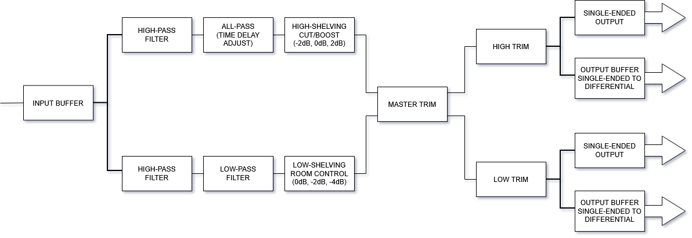

# Studio Monitor – Active Bi-Amplified System

## Overview
This project is a high-fidelity active studio monitor featuring a bi-amplified design. 
It integrates separate amplification for the low and high frequency drivers, allowing precise control over crossover points and individual channel levels.

## Key Technical Highlights
- Bi-amplified configuration with independent low and high frequency amplifiers
- Active crossover with adjustable filter slopes. The crossover is based on a **Linkwitz–Riley 4th-order topology**,
- Optimized for nearfield studio monitoring
- High-quality components selected for low noise and distortion
- Modular design allowing easy upgrades or modifications of individual sections (crossover, amplifier, power supply, etc.)

## Technical Summary
- Two-Way active crossover (Tweeter and Woofer)
- Linkwitz-Riley 4th order (24dB/Octave) filters
- Balanced or single-ended input using **OPA1637**
- Filter and buffer stages based on **NE5532**
- Each monitor features a master-level potentiometer to adjust its input sensitivity.
- The crossover PCB features adjustable output trimpots for fine-tuning the sensitivity of the woofer and tweeter.
- Adjustable tweeter delay for time alignment at the crossover frequency.
The crossover offers two operating modes:
1 - Predefined delay for use in standard bookshelf speaker configurations (tweeter + woofer) 
2 - In-phase signals for both woofer and tweeter, suitable for a D'Appolito configuration (woofer + tweeter + woofer)
- High-pass filter for seamless integration with subwoofers
- Room control: bass shelving adjustment (0dB, -2dB, -4dB) for optimizing room response and for baffle step compensation
- High-frequency trimming (-2dB, 0dB, 2dB) for tweeter "brightness" adjustment, according to room reflections or user preference

> Throughout the design, attention was given to op-amp selection, grounding strategy, and PCB trace layout to minimize crosstalk and noise.

## System Block Diagram
The following diagram shows the signal flow through the crossover stages:



## Folder Structure 
```
studio-monitor/
├── active-crossover-two-way/ → Images, calculation, measurements, etc.
├── power-supply/             → Images, calculation, measurements, etc.
├── power-amplifier/          → Images, calculation, measurements, etc
├── xlr-rca-input/            → Images, calculation, measurements, etc
└── images/                   → Block-diagram, prototype photos, etc.
```

Note: For more details, check individual folders (crossover, power supply, etc.)