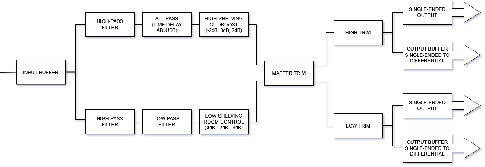

# Active Two-Way Audio Crossover (MONO)
Analog active crossover designed for Hi-Fi audio systems.  
This project splits the audio spectrum into **low** and **high** frequency bands, using precision operational amplifiers and high-quality components for minimal distortion and noise.

## Overview
The crossover is based on a **Linkwitz–Riley 4th-order topology**, widely known for offering flat summed response and constant phase.  
It provides both **balanced differential outputs** and **single ended outputs**, to drive a wide variety of amplifiers.
The main goal is to achieve **studio-grade performance** in a fully analog signal path.

## Main Features
- Two-Way active crossover (Tweeter and Woofer)
- Linkwitz-Riley 4th order (24dB/Octave) filters
- Balanced inputs/outputs using **OPA1637**
- Filter and buffer stages based on **NE5532**
- A master level potentiometer to adjust the overall input sensitivity
- Adjustable output trims for speaker sensitivity matching
- Adjustable tweeter delay for time alignment at the crossover frequency.
The crossover provides two options:
1 - Predefined delay for use in standard bookshelf speaker configurations (tweeter + woofer) 
2 - In-phase signals for both woofer and tweeter, suitable for a D'Appolito configuration (woofer + tweeter + woofer)
- High-pass filter for seamless integration with subwoofers
- Room control: bass shelving adjustment (0dB, -2dB, -4dB) for optimizing room response and for baffle step compensation
- High frequency trimming (-2dB, 0dB, 2dB) for tweeter "brightness" adjust, according to room reflexion or user preference

## Technical Summary
| Parameter | Specification |
|------------|---------------|
| Crossover frequency | 2.0 kHz |
| Filter type | Linkwitz–Riley, 4th order |
| Output type | Single-Ended | Differential(balanced) |
| Input impedance | TBD (To Be Defined).... kΩ |
| Output impedance | TBD (To Be Defined)... Ω |
| Power supply | ±15 V DC |

## Design and Development
- [x] Circuit design and validation
- [x] PCB Layout finalized in KiCAD
- [x] Prototype testing and measurements
- [ ] Assembly and testing
- [ ] Final measurements and documentation
> Throughout the design, attention was given to op-amp selection, grounding strategy, and PCB trace layout to minimize crosstalk and noise.

## System Block Diagram
The following diagram shows the signal flow through the crossover stages:



## Folder Structure 
```
studio-monitor/
├── crossover/           → Active crossover (Linkwitz-Riley 4th order)
├── power-supply/        → Linear ±15 V regulated power supply (crossover) and ±35 V unregulated power supply (LM3886)
├── power-amplifier/     → LM3886-based amplifier modules
├── XLR-RCA input/       → PCB for input selection, filtering and protection
├── docs/                → Design notes, calculations, and simulations
└── images/              → Schematics, diagrams, and renderings```
