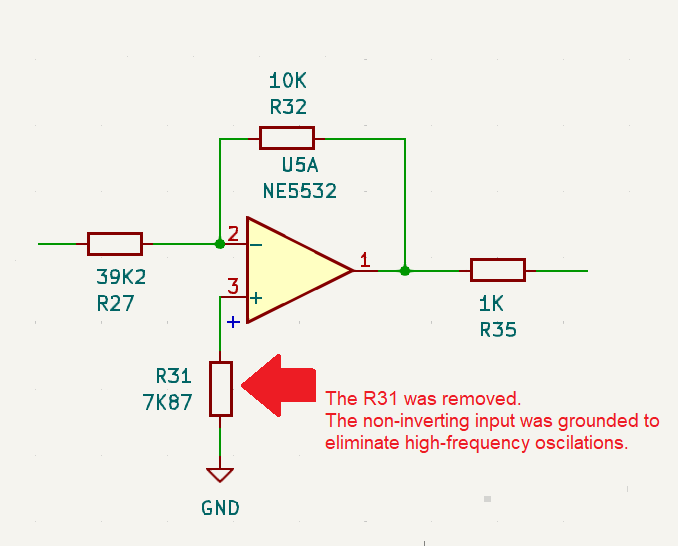
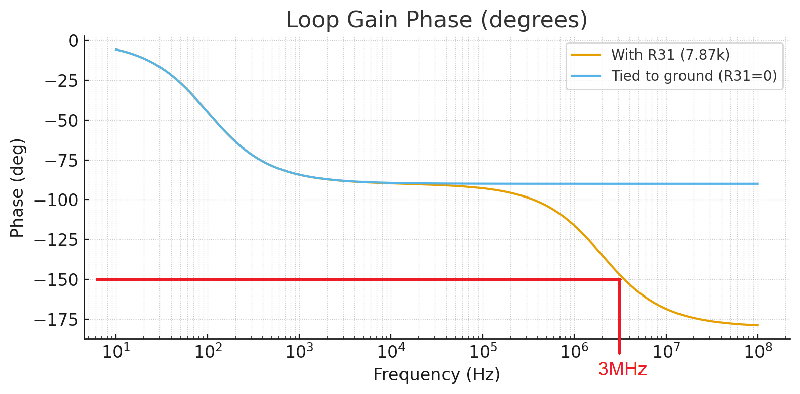

# High-frequency oscillation fix on U5A (NE5532)

As soon as the prototype PCB arrived, the first measurements were taken and an oscillation around 3 MHz was observed at the crossover output. To determine the origin of the problem, a 1Vp_1kHz signal was applied to the crossover input, and the signal was tracked until the point where it was being degraded. The problem was located in the shelving filter responsible for the tweeter adjustment, more specifically in the inverting amplifier. See the picture below:

 After some research and analysis, I found out that R31, placed  to balance the DC bias of the op-amp inputs, was causing the issue. This resistor, together with the input capacitance of the op-amp, introduced a high-frequency pole that reduced phase margin, which caused the observed oscillation. See the picture below:

By grounding the non-inverting input directly (removing R31), the phase margin improved and the oscillation was completely eliminated. See the picture below:

The simulated phase graph can be seen in the picture below:

It becomes clear that around 3MHz the total phase shift is approximately 330°, which is already enough to make the circuit unstable.

